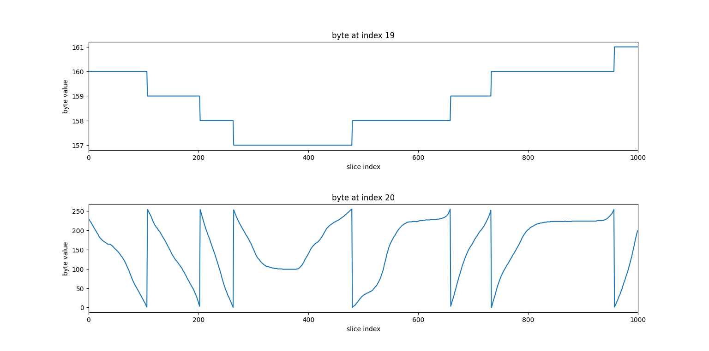
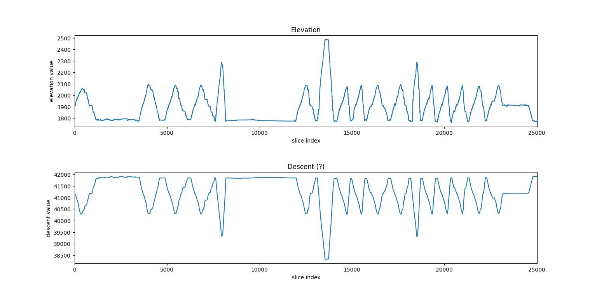
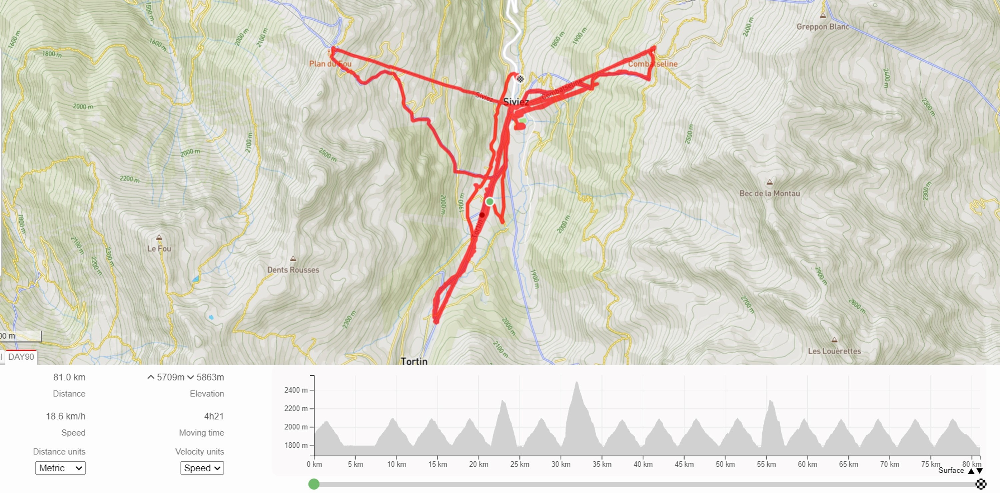

# .rib to .gpx file converter for Recon Instruments smartglasses
## Introduction
[Recon Instruments](https://en.wikipedia.org/wiki/Recon_Instruments) developed smartglasses. 
[Snow2](https://vandrico.com/wearables/device/recon-instruments-snow2.html#:~:text=About%20Snow2,designed%20for%20skiing%20and%20snowboarding.)
was one of these smartglasses produced by Recon instruments. By wearing these goggles you could track your location while skiing or snowboarding.
This data of that activity is then saved as a .rib file by the goggles. Normally a user would be able to use an app, made by Recon, to convert this .rib file to a .gpx file.
However, in 2015 Recon Instruments was acquired by Intel and two years later, in 2017, Intel discontinued Recon Instruments.
With this the support to convert .rib files to .gpx files was also dropped.

This Python project converts .rib files generated by smartglasses from Recon Instruments to .gpx files. 
Only .rib files from the Snow2 and the Zeal Optics Transcend were able to be tested.
Maybe this project works for other smartglasses produced by Recon, but since I don't have access to any of these smartglasses, this could not be tested.

## Usage
[Python 3.10](https://www.python.org/downloads/) is required to run this program. The commands in this section have to be run from the directory where you cloned this project

### convert .rib to .gpx
By running the following command the given .rib file will be converted to a .gpx file with the same name as the .rib file:

```bash
python src/main.py --in <your relative input file path> --mode <mode number>
```  

`<mode number>` is used to indicate which type of goggles of Recon Instruments tracked the activity.
`<mode number>` should be eiter `1` or `2`.
The mode number of the following goggles are known:  

Mode `1`:  
* Snow2  

Mode `2`:  
* Zeal Optics Transcend

(Note: goggles which create .rib files which have to be converted in mode `2`
do not have data containing the date when the activity took place. 
So, when converting these files to .gpx files the date when the file is converted 
will be used as the date when the activity took place.)

### convert .rib to .gpx in a custom output path
If you want to create a custom output path, you have to use the `--out` flag:


```bash
python src/main.py --in <your relative input file path> --out <your relative output file path> --mode <mode number>
```

### convert .rib to .gpx by using an IDE
If you are used to running Python files using an IDE you can also run the `manually.py` file which is located under [src](./src).
Be sure to change the values of the `input_file_path_string` variable and the `output_file_path_string` to the correct paths.
Change the value of the `mode_string` variable to either `'1'` or `'2'` depending on the type of smartglasses which generated the .rib file.

### Example
In this project there is an example `DAY90.rib` file given in the [./example](./example) directory.
This file was generated by Snow2 goggles, so mode `1` has to be used.
To convert this file with a default output path, the following command needs to be run:

```bash
python src/main.py --in example/DAY90.rib --mode 1
``` 

There is another example `DAY04.rib` file given in the [./example](./example) directory.
This file was generated by Zeal Optics Transcend goggles, so mode `2` has to be used.
To convert this file with a custom output path, `output/04_OUT.gpx`, the following command needs to be run:

```bash
python src/main.py --in example/DAY04.rib --out output/04_OUT.gpx --mode 2
``` 

## How this program was made

My brother wanted to convert a .rib file from his Snow2 goggles to a .gpx file,
so he sent such a file. This `DAY90.rib` file can be seen in the [/example](./example) directory.
This file was of an activity which started on the 24th of January 2022 at around 8:50.
By knowing where the activity took place and with the help of [this](https://www.latlong.net/convert-address-to-lat-long.html) and [this site](https://www.freemaptools.com/elevation-finder.htm)
I knew that the activity started around a latitude of `46.126030`, a longitude of `7.312903` and an elevation of `1833` meters.  

The following explanation is for a file produced by the Snow2 goggles. 
The explanation is analogous for files produced by Zeal Optics Transcend. 
These files however, don't have data for the Unix time and don't have a delimiter.
So, the indices used in the explanation will be slightly different for these type of files.
### Slicing the data

When printing the first 200 bytes of this `DAY90.rib` file the following result is shown:

```
\r\xe8\x80\xc1\xc2CDE\x06G a\xa4ca\xeeg\xff\x96\x01\x18.\x07>L\x07\x12O#\x00\x96\x07\x8a\xa0\xe8(\x10\r\xff\xff\xff\xff\xff\xff\xff\xffa\xeeh\x01\x081\x05.\x07>2\x07\x12O\x16\x00\x00\x07\x87\xa0\xe6(\x10\r\xff\xff\xff\xff\xff\xff\xff\xffa\xeeh\x02\x081\x06.\x07>\x1f\x07\x12O\t\x00\x93\x07\x87\xa0\xe4(\x10\r\xff\xff\xff\xff\xff\xff\xff\xffa\xeeh\x03\x081\x07.\x07>\x05\x07\x12N`\x00\x81\x07\x85\xa0\xe1(\x10\r\xff\xff\xff\xff\xff\xff\xff\xffa\xeeh\x04\x081\x08.\x07=V\x07\x12NS\x00\x98\x07\x84\xa0\xdf(\x10\r\xff\xff\xff\xff\xff\xff\xff\xffa\xeeh\x05\x081\t.\x07=I\x07\x12NF\x00\x8f\x07\x84\xa0\xdd(\x10\r\xff\xff\xff
``` 

Not much can be made from this. However, if the decimal values of these bytes are printed, the following can be seen:

```python
13, 232, 128, 193, 194, 67, 68, 69, 6, 71, 32, 97, 164, 99, 97, 238, 103, 255, 150, 1, 24, 46, 7, 62, 76, 7, 18, 79, 35, 0, 150, 7, 138, 160, 232, 40, 16, 13, 255, 255, 255, 255, 255, 255, 255, 255, 97, 238, 104, 1, 8, 49, 5, 46, 7, 62, 50, 7, 18, 79, 22, 0, 0, 7, 135, 160, 230, 40, 16, 13, 255, 255, 255, 255, 255, 255, 255, 255, 97, 238, 104, 2, 8, 49, 6, 46, 7, 62, 31, 7, 18, 79, 9, 0, 147, 7, 135, 160, 228, 40, 16, 13, 255, 255, 255, 255, 255, 255, 255, 255, 97, 238, 104, 3, 8, 49, 7, 46, 7, 62, 5, 7, 18, 78, 96, 0, 129, 7, 133, 160, 225, 40, 16, 13, 255, 255, 255, 255, 255, 255, 255, 255, 97, 238, 104, 4, 8, 49, 8, 46, 7, 61, 86, 7, 18, 78, 83, 0, 152, 7, 132, 160, 223, 40, 16, 13, 255, 255, 255, 255, 255, 255, 255, 255, 97, 238, 104, 5, 8, 49, 9, 46, 7, 61, 73, 7, 18, 78, 70, 0, 143, 7, 132, 160, 221, 40, 16, 13, 255, 255, 255
``` 

Unsigned bytes have a decimal value between `0` and `255`. In the printed numbers a pattern can be seen: there are blocks of `255` every now and then.
These blocks of `255` are always exactly of size eight. Between these blocks there are 24 other numbers.
These blocks could be a [delimiter](https://en.wikipedia.org/wiki/Delimiter), a sequence of one or more characters for specifying the boundary between separate, independent regions.
Now we slice the data after every block to get separate data slices.
The data before the first block is discarded since it does not follow the pattern of the 24 numbers. This discarded data is probably for the file header.

When printing the first three slices we get the following:

```python
[97, 238, 104, 1, 8, 49, 5, 46, 7, 62, 50, 7, 18, 79, 22, 0, 0, 7, 135, 160, 230, 40, 16, 13, 255, 255, 255, 255, 255, 255, 255, 255]
``` 

```python
[97, 238, 104, 2, 8, 49, 6, 46, 7, 62, 31, 7, 18, 79, 9, 0, 147, 7, 135, 160, 228, 40, 16, 13, 255, 255, 255, 255, 255, 255, 255, 255]
``` 

```python
[97, 238, 104, 3, 8, 49, 7, 46, 7, 62, 5, 7, 18, 78, 96, 0, 129, 7, 133, 160, 225, 40, 16, 13, 255, 255, 255, 255, 255, 255, 255, 255]
``` 

### Finding the meaning of these values
Now the meaning of these numbers in each slice needs to be discovered.
This is GPS data, so it is probable that the data contains the following information: longitude, latitude, time, speed and elevation.

The slices are put in a column of a table to be able to analyze them easier:

| Index |  Meaning   | Slice 1 | Slice 2 | Slice 3 |
|:-----:|:----------:|---------|---------|---------|
|   0   |     ?      | 97      | 97      | 97      |
|   1   |     ?      | 238     | 238     | 238     |
|   2   |     ?      | 104     | 104     | 104     |
|   3   |     ?      | 1       | 2       | 3       |
|   4   |     ?      | 8       | 8       | 8       |
|   5   |     ?      | 49      | 49      | 49      |
|   6   |     ?      | 5       | 6       | 7       |
|   7   |     ?      | 46      | 46      | 46      |
|   8   |     ?      | 7       | 7       | 7       |
|   9   |     ?      | 62      | 62      | 62      |
|  10   |     ?      | 50      | 31      | 5       |
|  11   |     ?      | 7       | 7       | 7       |
|  12   |     ?      | 18      | 18      | 18      |
|  13   |     ?      | 79      | 79      | 79      |
|  14   |     ?      | 22      | 9       | 96      |
|  15   |     ?      | 0       | 0       | 0       |
|  16   |     ?      | 0       | 147     | 129     |
|  17   |     ?      | 7       | 7       | 7       |
|  18   |     ?      | 135     | 135     | 135     |
|  19   |     ?      | 160     | 160     | 160     |
|  20   |     ?      | 230     | 228     | 225     |
|  21   |     ?      | 40      | 40      | 40      |
|  22   |     ?      | 16      | 16      | 16      |
|  23   |     ?      | 13      | 13      | 13      |
|  24   | delimiter  | 255     | 255     | 255     |
|  25   | delimiter  | 255     | 255     | 255     |
|  26   | delimiter  | 255     | 255     | 255     |
|  27   | delimiter  | 255     | 255     | 255     |
|  28   | delimiter  | 255     | 255     | 255     |
|  29   | delimiter  | 255     | 255     | 255     |
|  30   | delimiter  | 255     | 255     | 255     |
|  31   | delimiter  | 255     | 255     | 255     |

#### Time
When analyzing the data in the columns it can be seen that the values at index `6` changed by one for consecutive slices.
This could mean that this data represented time. With the knowledge that the activity started around 8:50 the following meaning can be given to the data:

| Index |   Meaning    | Slice 1  | Slice 2 | Slice 3 |
|:-----:|:------------:|----------|---------|---------|
|   4   |    hours     | 8        | 8       | 8       |
|   5   |   minutes    | 49       | 49      | 49      |
|   6   |   seconds    | 5        | 6       | 7       |

#### Unix Time
The values at index `3` seem to also change by one for consecutive slices. So, it seems that the four first bytes could represent time as well.
If four bytes are needed to represent this time value we can get the real value by calculating the following: 

```python
time_value  =  slice[0] * 256³  +  slice[1] * 256²  +  slice[2] * 256  +  slice[3]
``` 

with `slice[i]` the value at index `i` in a slice.  

If this is done for `Slice 1` we get the following result:  

```python
time_value  =  97 * 256³  +  238 * 256²  +  104 * 256  +  1 = 1643014145
```

This is a large number, this could be a [Unix time](https://en.wikipedia.org/wiki/Unix_time) stamp. 
When converting this timestamp by using the [following site](https://www.unixtimestamp.com/) we get: `Mon Jan 24 2022 08:49:05 GMT+0000`. This seems correct.
So, the following information is obtained:

| Index |  Meaning   | Slice 1 | Slice 2 | Slice 3 |
|:-----:|:----------:|---------|---------|---------|
|   0   | Unix time  | 97      | 97      | 97      |
|   1   | Unix time  | 238     | 238     | 238     |
|   2   | Unix time  | 104     | 104     | 104     |
|   3   | Unix time  | 1       | 2       | 3       |

(Fun fact: the maximum value of an unsigned byte is `255`. 
So, if we plug this maximum value in the `time_value` formula above we get `4294967295`. 
If this Unix timestamp is converted the following result is obtained: `	Sun Feb 07 2106 06:28:15 GMT+0000`.
This means that on the 7th of February 2106 the bytes representing the Unix time will overflow.)


#### Latitude and Longitude
After googling a bit, this [site](https://wiki.teltonika-gps.com/wikibase/index.php?title=Teltonika_Data_Sending_Protocols&mobileaction=toggle_view_desktop) was found.
The site contained the following information about GPS data:

| Longitude | Latitude  | Altitude | Angle   | Sattelites | Speed   |
|-----------|-----------|----------|---------|------------|---------|
| 4 bytes   | 4 bytes   | 2 bytes  | 2 bytes | 1 bytes    | 2 bytes |

So, maybe here there were also four bytes used for the latitude and four bytes for the longitude.
I knew that the latitude should be around `46.126030` and the longitude around `7.312903`.
The value at index `7` is `46` and the value at index `11` is `7` for all the three slices.
So this could mean that the values from index `7` to `10` represent the latitude 
and the values from index `11` to `14` represent the longitude.  

The first byte of the four bytes already seemed to represent the whole degree of a coordinate. 
For example, for the latitude, the value at index `7` is `46`, 
which is the whole degree of the expected latitude `46.126030`.
After some searching it was found that the three other bytes represent the minutes. 
The minutes could be calculated in the following manner for the latitude:  

```python
minutes  =  slice[8] * 100²  +  slice[9] * 100  +  slice[10]
```

The value of the minutes need to be between `0` and `59`, so it has to be divided by `100²`.
The following formula is used to get the value of the coordinate of the latitude:  

```python
coordinate  =  slice[7] + (minutes / (60 * 100²))
```
The result of this for `Slice 1` is `46.12708333333333`, which seemed to be correct. 
The formula to calculate the value of the coordinate of the longitude is analogous.  

So, the meaning of the following data is found:

| Index |  Meaning   | Slice 1 | Slice 2 | Slice 3 |
|:-----:|:----------:|---------|---------|---------|
|   7   |  latitude  | 46      | 46      | 46      |
|   8   |  latitude  | 7       | 7       | 7       |
|   9   |  latitude  | 62      | 62      | 62      |
|  10   |  latitude  | 50      | 31      | 5       |
|  11   | longitude  | 7       | 7       | 7       |
|  12   | longitude  | 18      | 18      | 18      |
|  13   | longitude  | 79      | 79      | 79      |
|  14   | longitude  | 22      | 9       | 96      |

#### Elevation
After looking for two bytes that could represent the altitude, the values at index `17` and `18` were found.
The elevation can be calculated using the following formula:

```python
elevation  =  slice[17] * 256 + slice[18]
```

For `Slice 1` this results in `1927`, which seems close to the expected `1833` meters.
In a similar way the two bytes for speed are found.

| Index |  Meaning  | Slice 1 | Slice 2 | Slice 3 |
|:-----:|:---------:|---------|---------|---------|
|  15   |   speed   | 0       | 0       | 0       |
|  16   |   speed   | 0       | 147     | 129     |
|  17   | elevation | 7       | 7       | 7       |
|  18   | elevation | 135     | 135     | 135     |

#### Descent?
When plotting the values of the data at index `19` and `20` for the first `1000` slices of the
`DAY90.rib` file, the following can be seen:  



On this plot you can see that whenever the value of the byte at index `20` 
goes over the maximum value `255` that the value of the byte at index `19` goes up by one and
that the value of the byte at index `20` goes back to `0`.
On the other hand, whenever the value of the byte at index `20`
goes under the minimum value `0`, the value of the byte at index `19` goes down by one and 
the value of the byte at index `20` goes back to `255`.
This could mean that these two bytes should be combined to get the real value this data represents.

The following values are gotten if these two bytes are combined 
the same way the two bytes representing the elevation are combined:  



The first graph shows the values for the elevation and the second graph shows the combined values of the bytes at index `19` and index `20`.
As you can see the combined values of the bytes at index `19` and index `20` 
are inversely related to the values of the elevation.
The bottom graph is also a bit smoother.
This leads me to believe that the bytes at index `19` and index `20` represent descent.
However, after some testing I cannot figure out how to map these values to values in meters.

#### Temperature
The smartglasses also contain a temperature sensor. 
So, there could be data representing the measured temperature.
After finding [this post](https://stackoverflow.com/questions/72362354/how-to-reverse-engineer-a-rib-file/72395748#72395748)
and with the help of the creator of that post it was found that the byte at index `21` contains the data for the temperature.  

The temperature in degrees Celsius can be calculated using the following formula:

```python
temperature  =  slice[21] - 40
```

So the meaning of the byte at index `21` is found:  

| Index |   Meaning   | Slice 1  | Slice 2 | Slice 3 |
|:-----:|:-----------:|----------|---------|---------|
|  21   | temperature | 40       | 40      | 40      |

#### Result
The meaning of the values of the following indices are found:

| Index |   Meaning   | Slice 1  | Slice 2 | Slice 3 |
|:-----:|:-----------:|----------|---------|---------|
|   0   |  Unix time  | 97       | 97      | 97      |
|   1   |  Unix time  | 238      | 238     | 238     |
|   2   |  Unix time  | 104      | 104     | 104     |
|   3   |  Unix time  | 1        | 2       | 3       |
|   4   |    hours    | 8        | 8       | 8       |
|   5   |   minutes   | 49       | 49      | 49      |
|   6   |   seconds   | 5        | 6       | 7       |
|   7   |  latitude   | 46       | 46      | 46      |
|   8   |  latitude   | 7        | 7       | 7       |
|   9   |  latitude   | 62       | 62      | 62      |
|  10   |  latitude   | 50       | 31      | 5       |
|  11   |  longitude  | 7        | 7       | 7       |
|  12   |  longitude  | 18       | 18      | 18      |
|  13   |  longitude  | 79       | 79      | 79      |
|  14   |  longitude  | 22       | 9       | 96      |
|  15   |    speed    | 0        | 0       | 0       |
|  16   |    speed    | 0        | 147     | 129     |
|  17   |  elevation  | 7        | 7       | 7       |
|  18   |  elevation  | 135      | 135     | 135     |
|  19   | descent (?) | 160      | 160     | 160     |
|  20   | descent (?) | 230      | 228     | 225     |
|  21   | temperature | 40       | 40      | 40      |
|  22   |      ?      | 16       | 16      | 16      |
|  23   |      ?      | 13       | 13      | 13      |
|  24   |  delimiter  | 255      | 255     | 255     |
|  25   |  delimiter  | 255      | 255     | 255     |
|  26   |  delimiter  | 255      | 255     | 255     |
|  27   |  delimiter  | 255      | 255     | 255     |
|  28   |  delimiter  | 255      | 255     | 255     |
|  29   |  delimiter  | 255      | 255     | 255     |
|  30   |  delimiter  | 255      | 255     | 255     |
|  31   |  delimiter  | 255      | 255     | 255     |

As you can see the meaning of the values of indices `22` and `23` are still not found. 
Maybe these bytes are used as a [checksum](https://en.wikipedia.org/wiki/Checksum).
However, the data found until now is sufficient to generate a valid .gpx file.

### Generating a .gpx file
Now that the meaning of the values is found the .gpx file can be generated.
This is simply done by making a header for this .gpx file.  

Then, a `<trkpt>` tag with its corresponding data is added for every slice.
Since there is no tag for the temperature for a `<trkpt>` in a .gpx file an `<extension>` tag is used.
This `<extension>` tag follows [Garmin’s Track Point Extension v1](https://www8.garmin.com/xmlschemas/TrackPointExtensionv1.xsd).  

To end, a footer is added to the end of the .gpx file.
This way the correct .gpx file is generated.  


After doing this for the `DAY90.rib` file a `DAY90.gpx` file is generated.
After uploading this file on this [site](https://gpx.studio/), the skiing activity tracked by the Recon Snow2 can finally be seen:


